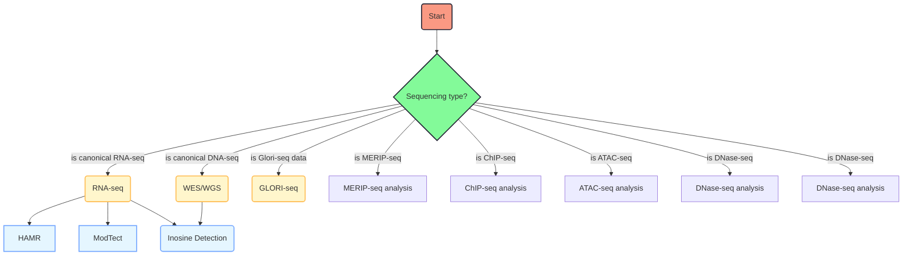

# Snakemake workflow: `<name>`

A Snakemake workflow for `<description>`

## Usage

The usage of this workflow is described in the [Snakemake Workflow Catalog](https://snakemake.github.io/snakemake-workflow-catalog/?usage=<owner>%2F<repo>).

If you use this workflow in a paper, don't forget to give credits to the authors by citing the URL of this (original) <repo>sitory and its DOI (see above).

# TODO

* Replace `<owner>` and `<repo>` everywhere in the template (also under .github/workflows) with the correct `<repo>` name and owning user or organization.
* Replace `<name>` with the workflow name (can be the same as `<repo>`).
* Replace `<description>` with a description of what the workflow does.
* The workflow will occur in the snakemake-workflow-catalog once it has been made public. Then the link under "Usage" will point to the usage instructions if `<owner>` and `<repo>` were correctly set.

